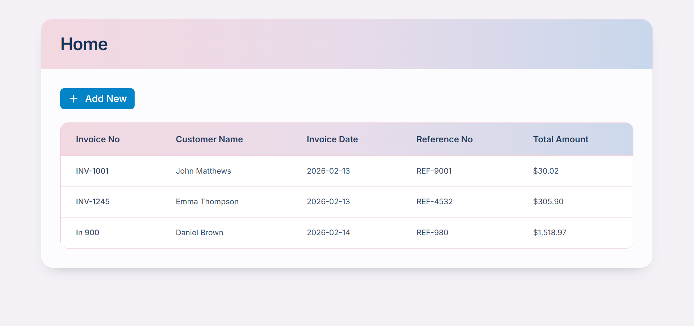
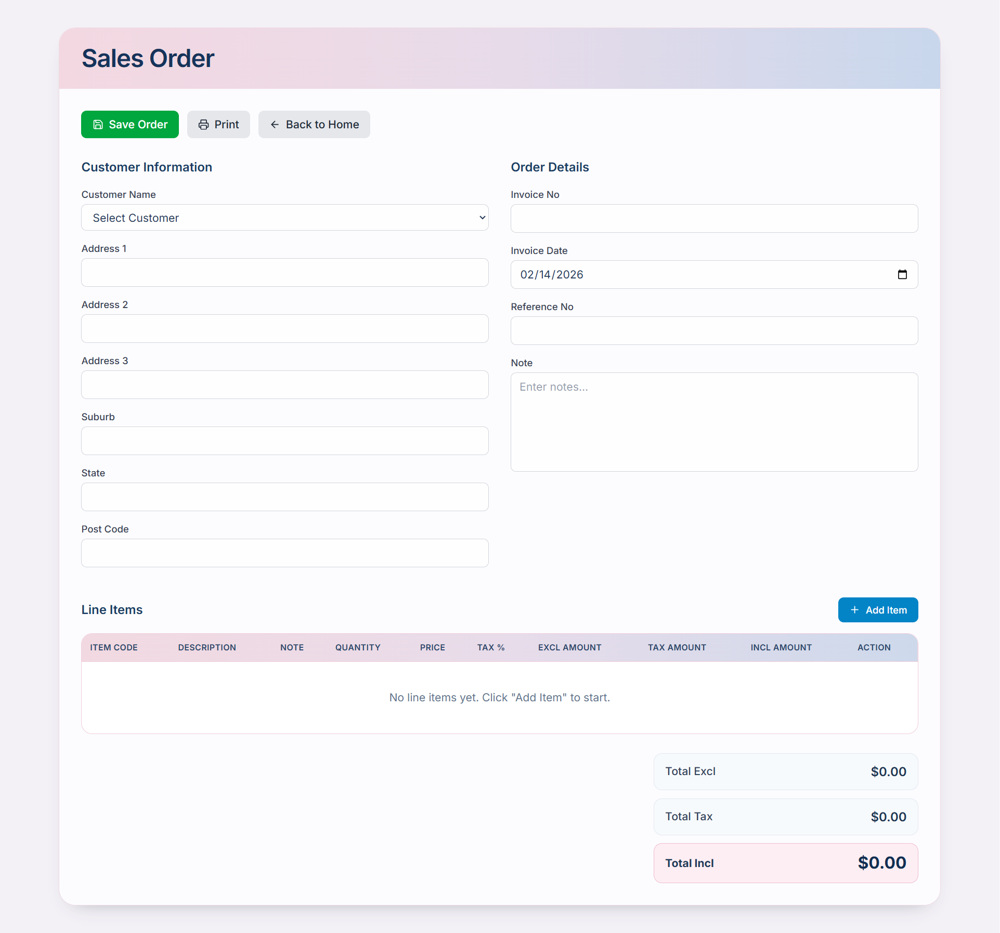
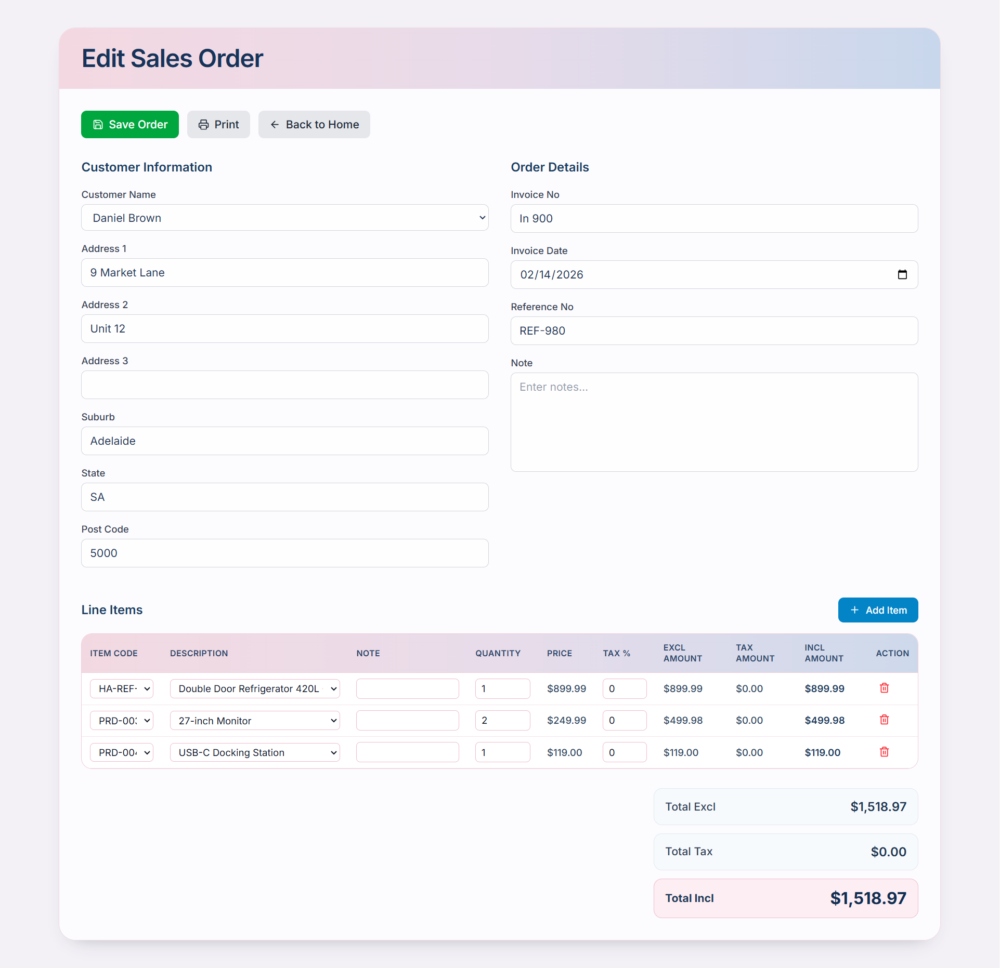
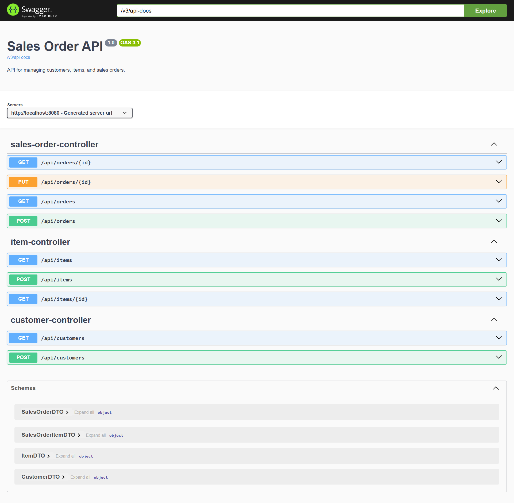

# Sales Order Management System

A full-stack web application for managing sales orders, built with **Spring Boot** (Backend) and **React** (Frontend).

---

## 📋 Table of Contents

- [Tech Stack](#-tech-stack)
- [Project Structure](#-project-structure)
- [Getting Started](#-getting-started)
- [API Documentation](#-api-documentation)
- [Screenshots](#-screenshots)

---

## 🛠 Tech Stack

### Backend
- **Framework:** Spring Boot 4.0.2
- **Language:** Java 17
- **ORM:** Spring Data JPA (Hibernate)
- **Database:** PostgreSQL
- **API Docs:** Swagger (SpringDoc OpenAPI)
- **Build Tool:** Maven

### Frontend
- **Library:** React 18
- **State Management:** Redux Toolkit
- **Routing:** React Router v7
- **HTTP Client:** Axios
- **Styling:** Tailwind CSS v4
- **Build Tool:** Vite

---

## 📁 Project Structure

```
sales-order-spillabs/
├── backend/                    # Spring Boot Backend
│   ├── src/main/java/com/spillabs/sales_order/
│   │   ├── config/             # Configuration classes
│   │   ├── controller/         # REST API Controllers
│   │   ├── service/
│   │   │   ├── interfaces/     # Service interfaces
│   │   │   └── implementations/# Service implementations
│   │   ├── repository/         # JPA Repositories
│   │   ├── domain/
│   │   │   └── entity/         # JPA Entities
│   │   └── dto/                # Data Transfer Objects
│   └── src/main/resources/
│       └── application.properties
│
├── frontend/                   # React Frontend
│   ├── src/
│   │   ├── components/         # Reusable UI components
│   │   ├── pages/              # Page components
│   │   ├── redux/
│   │   │   ├── slices/         # Redux slices
│   │   │   └── store.js        # Redux store configuration
│   │   ├── services/           # API service layer
│   │   └── utils/              # Utility functions
│   ├── tailwind.config.js
│   └── package.json
│
└── README.md
```

---


## 🚀 Getting Started

### Prerequisites

- Java 17+
- Node.js 18+
- PostgreSQL
- Maven

### Backend Setup

```bash
# Navigate to backend directory
cd backend

# Configure database in application.properties
# spring.datasource.url=jdbc:postgresql://localhost:5432/sales-order
# spring.datasource.username=your_username
# spring.datasource.password=your_password

# Run the application
mvn spring-boot:run
```

Backend will start at: `http://localhost:8080`

### Frontend Setup

```bash
# Navigate to frontend directory
cd frontend

# Install dependencies
npm install

# Start development server
npm run dev
```

Frontend will start at: `http://localhost:5173`

---

## 📖 API Documentation

Swagger UI is available at: `http://localhost:8080/swagger-ui.html`

### API Endpoints

| Method | Endpoint | Description |
|--------|----------|-------------|
| GET | `/api/customers` | Get all customers |
| GET | `/api/items` | Get all items |
| GET | `/api/items/{id}` | Get item by ID |
| GET | `/api/orders` | Get all sales orders |
| GET | `/api/orders/{id}` | Get order by ID |
| POST | `/api/orders` | Create new order |
| POST | `/api/customers` | Create customer |
| POST | `/api/items` | Create item |
| PUT | `/api/orders/{id}` | Update existing order |

---

## 📸 Screenshots

### Application Interface

#### Home Page (Order List)
<!-- Add your screenshot here -->

*Home screen displaying the list of all sales orders with Add New button*

#### Sales Order Form - New Order
<!-- Add your screenshot here -->

*Sales Order form for creating a new order*

#### Sales Order Form - Edit Order
<!-- Add your screenshot here -->

*Sales Order form with pre-filled data for editing*


---

### Swagger API Documentation

<!-- Add your screenshot here -->



